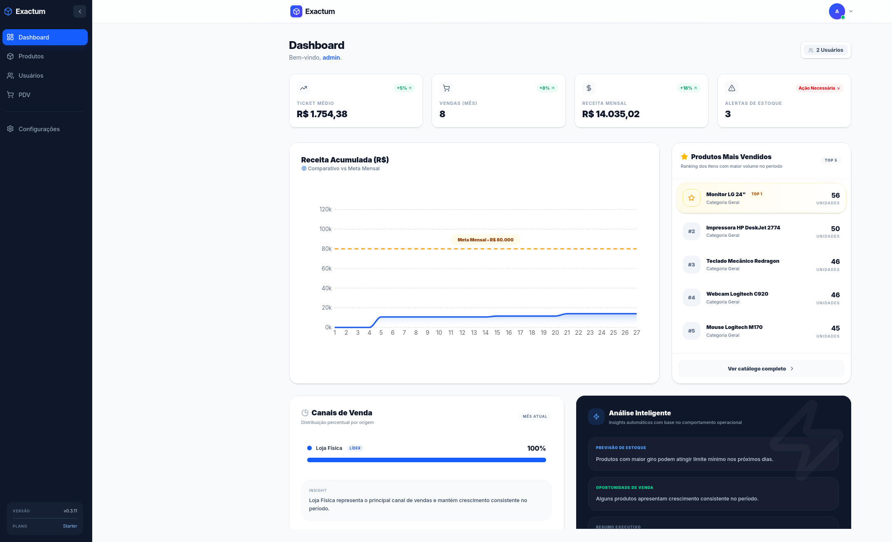
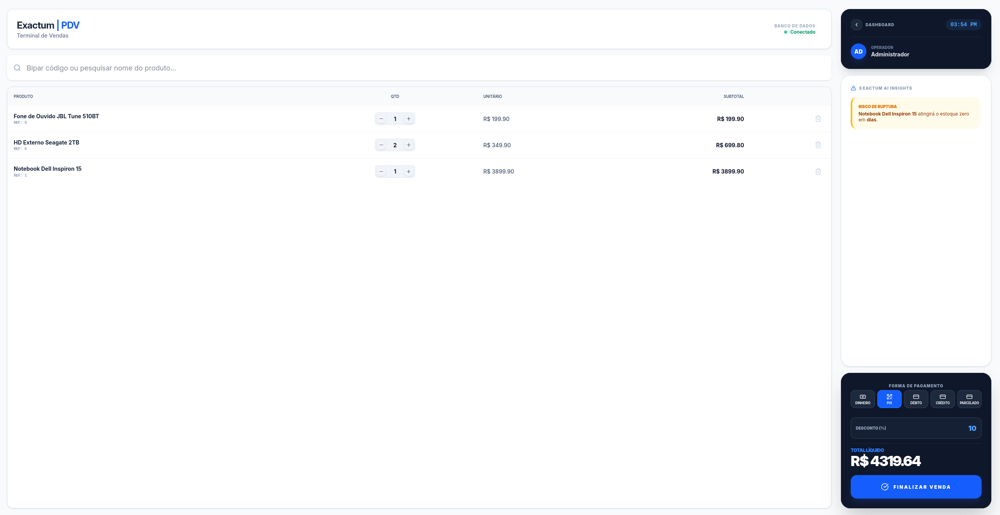
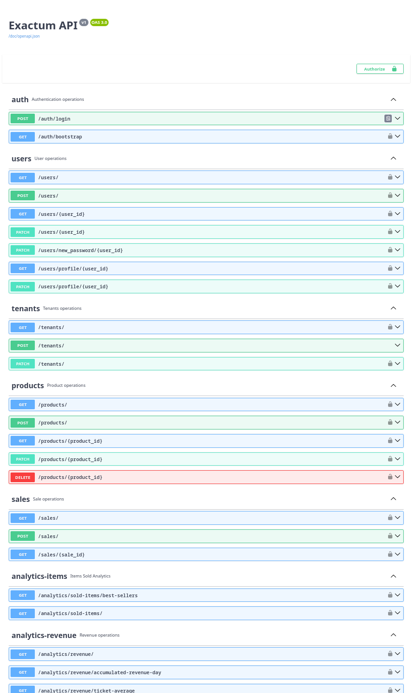
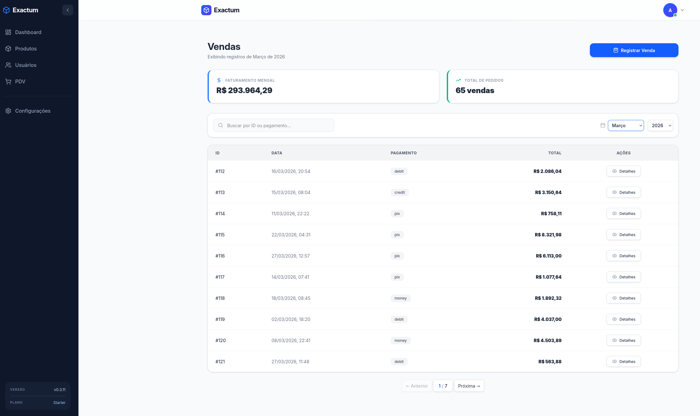
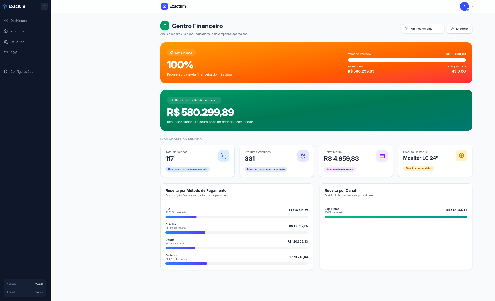
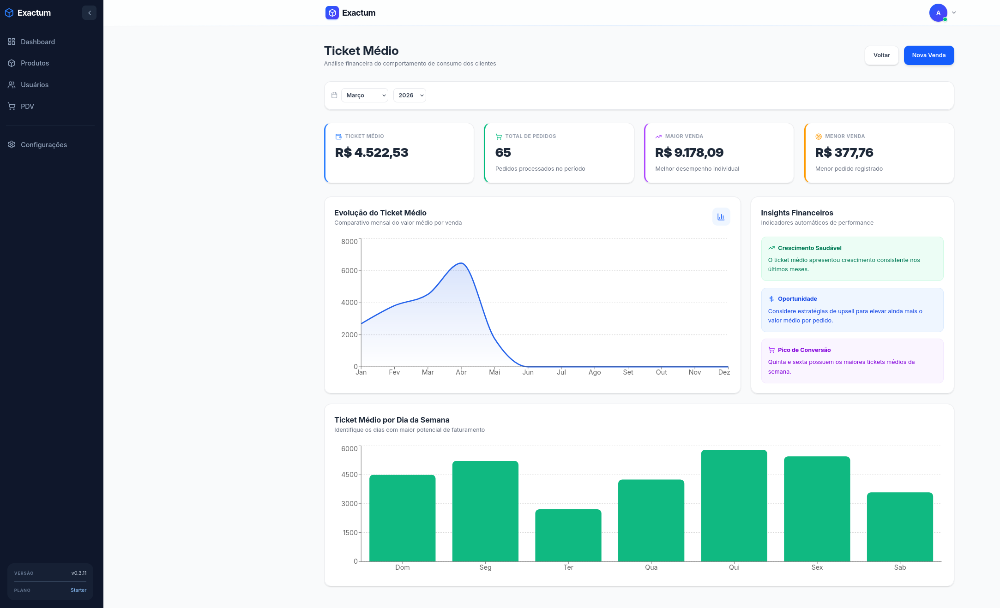

# Exactum

> ERP Web Fullstack para gestão de estoque e PDV de pequenos e médios comércios — substituindo o "achismo" por decisões baseadas em dados históricos, com arquitetura multi-tenant isolada por middleware e pronta para escala.

🔗 **[Demo ao Vivo](https://exactum.app.br/)** · 🐛 **[Reportar Bug](https://github.com/orafaeldantas/exactum-api/issues)**

⚠️ **Nota:** O projeto encontra-se atualmente em **fase Alpha**. A estrutura central de segurança, multi-tenancy e PDV já estão totalmente operacionais, enquanto recursos preditivos e otimizações de infraestrutura estão sendo implantados ativamente (veja nosso Roadmap).

<p align="left">
  
  
  
  
  
  
  
  
  
  
  
  
  
</p>

<!--  
---

## 📺 Demonstração

[](https://www.youtube.com/watch?v=SEU_VIDEO_ID)

---
-->

#### 📊 Dashboard Principal


<details>
<summary>📸 Clique aqui para ver capturas de tela do sistema</summary>
<br />

### 🛒 Módulo Operacional
* **Frente de Caixa (PDV):** Interface ágil para registro de vendas e baixa automática de estoque.
  
* **Documentação da API:** Endpoints auto-documentados via Swagger UI.
  

### 📊 Painel Gerencial & Indicadores
* **Dashboard de Vendas do Mês:** Acompanhamento do volume financeiro e evolução das transações.
  
* **Análise de Receita e Ticket Médio:** Gráficos de faturamento e o valor médio gasto por cliente para apoiar tomadas de decisão.
  
  

</details>

---

## 🎯 O Problema que Resolve

A gestão de estoque no pequeno varejo ainda é feita com base na intuição ("no olho"). O resultado disso é um ciclo prejudicial: capital imobilizado em mercadoria parada ou perda de faturamento por falta de produto.

O **Exactum** centraliza o fluxo de entradas, saídas e PDV, utilizando o histórico de movimentação para automatizar a inteligência do negócio. Através de alertas estruturados e modelos de previsão de demanda por período, o sistema transforma a reposição de estoque em uma decisão puramente técnica e orientada a dados.

---

## 🛠️ Funcionalidades e Roadmap

| Módulo / Funcionalidade | Status | Camada |
| :--- | :---: | :---: |
| Autenticação com recuperação via senha temporária | ✅ Produção | Backend / Frontend |
| RBAC com 3 níveis (Super Admin, Admin, Operário) | ✅ Produção | Backend / Frontend |
| Multi-tenant com isolamento lógico via Middleware | ✅ Produção | Backend |
| Impersonate de usuários (Diagnóstico técnico como admin) | ✅ Produção | Backend |
| Onboarding de tenant via página dedicada | ✅ Produção | Frontend |
| PDV integrado ao controle de estoque em tempo real | ✅ Produção | Fullstack |
| Dashboard interativo com gráficos de movimentação | ✅ Produção | Frontend |
| API REST auto-documentada (Flask-Smorest + Marshmallow) | ✅ Produção | Backend |
| CI/CD automatizado + Deploy em VPS Hetzner dedicada | ✅ Produção | DevOps |
| Versionamento de banco e automação de schemas (Flask-Migrate / Alembic) | ✅ Produção | DevOps / Backend |
| **Análise preditiva de estoque (Machine Learning)** | 🔄 Desenvolvimento | AI / Backend |
| Geração de Nota Fiscal Eletrônica (API simulada) | 📋 Roadmap | Backend |
| Exportação de relatórios gerenciais (CSV/PDF) | 📋 Roadmap | Fullstack |
| Logs de auditoria e segurança (Trail Audit) | 📋 Roadmap | Backend |

---

## 🧳 Arquitetura e Stack Tecnológica

### Backend
* **Flask (Estrutura MVC Patrão):** Utiliza **Flask-Smorest** para roteamento estrito e geração automática da documentação OpenAPI/Swagger. Validação robusta de payloads com **Marshmallow** e qualidade de código assegurada via **Ruff**.
* **SQLAlchemy (ORM):** Abstração de banco com queries explicitamente filtradas por Tenant ID em nível de repositório, mitigando riscos de vazamento de dados.
* **PostgreSQL:** Banco de dados relacional utilizando transações ACID estritas para garantir a consistência do histórico de movimentações do PDV.

### Frontend
* **React (Vite):** SPA rápida, com estado previsível e componentização limpa.
* **Tailwind CSS:** Estilização baseada em classes utilitárias para garantir uma UI fluida, responsiva e de alta performance.
* **Nginx:** Atua como servidor web estático de alta performance para a build do React.

### Infraestrutura & DevOps
* **Docker & Docker Compose:** Containerização de todo o ambiente, eliminando o comportamento de "funciona na minha máquina".
* **Nginx (Reverse Proxy):** Gateway central que gerencia o roteamento de tráfego TLS/HTTP para o frontend e para a API.
* **CI/CD:** Pipeline automatizado via **GitHub Actions** realizando testes integrados e deploy automatizado na VPS (**Hetzner**).

### 🚀 Roadmap Técnico (Próximos Passos)
- [ ] Implementação de cache de alta performance com **Redis**
- [ ] Processamento de tarefas assíncronas com **Celery + RabbitMQ**
- [ ] Observabilidade centralizada com **Prometheus + Grafana**
- [ ] Migração de arquitetura para **DDD (Domain-Driven Design)**
- [ ] Integração com **Groq API** (LLM) para insights e análises preditivas na UI

---

## ⚖️ Decisões Técnicas

### 🔒 Dupla Camada de Segurança no Tenant (Zero-Trust)
A maioria das aplicações multi-tenant confia em um único filtro para isolar os dados dos clientes, o que abre margem para falhas humanas em queries complexas. No Exactum, adotamos uma abordagem de "paranoia intencional" com dupla validação:
1. **Validação via Middleware (O Guardião):** Toda requisição que entra na API é interceptada. O middleware identifica o usuário, valida suas permissões e estabelece de forma imutável o contexto do tenant para aquela sessão. 
2. **Filtro Explícito na Query:** A camada de persistência não confia cegamente no contexto. Todas as queries possuem obrigatoriamente um filtro explícito de tenant. 

> As duas camadas precisam bater perfeitamente para que qualquer dado seja exposto. Esse isolamento redundante elimina o risco de vazamento de informações entre contas.

### 🔑 Recuperação de Senha via Credencial Temporária
Em vez do fluxo tradicional de e-mail com links de expiração rápida, o administrador define uma senha temporária para o usuário. No primeiro login, o sistema força a troca imediata para uma senha definitiva. Esse fluxo foi desenhado sob medida para o perfil do pequeno varejo, onde o gestor tem contato direto com sua equipe de frente de caixa.

### ⚡ Flask-Smorest + Marshmallow vs FastAPI
O Flask-Smorest entrega o melhor dos dois mundos: mantém a flexibilidade e a maturidade do ecossistema Flask enquanto gera documentação OpenAPI automaticamente a partir dos schemas Marshmallow. Isso elimina a duplicação de código e centraliza a validação e a serialização em uma única fonte de verdade.

### 🚀 Ruff como Linter Único
Substitui completamente a cadeia composta por *Flake8 + isort + Black* com uma configuração unificada em arquivo e velocidade significativamente maior. Em um ambiente com CI/CD ativo, a redução no tempo de execução do pipeline otimiza os ciclos de entrega.

---

## 📂 Estrutura do Projeto

```text
exactum-api/
├── backend/
│   ├── app/
│   │   ├── routes/           # Endpoints e Blueprints (Flask-Smorest)
│   │   ├── controllers/      # Orquestração de requisições
│   │   ├── models/           # Entidades e mapeamento SQLAlchemy
│   │   ├── schemas/          # Validação e serialização (Marshmallow)
│   │   ├── services/         # Camada com as regras de negócio isoladas
│   │   ├── repositories/     # Abstração de queries e persistência
│   │   └── middleware/       # Captura de contexto e segurança de Tenant
│   ├── migrations/           # Controle de versão do banco (Alembic)
│   └── Dockerfile
├── frontend/
│   ├── src/                  # Componentes e views em React
│   ├── nginx/                # Configurações de roteamento do SPA
│   └── Dockerfile
├── .github/workflows/        # Fluxos de CI/CD (Build & Deploy)
├── docker-compose.yml        # Orquestração dos containers locais
└── .env.example              # Modelo de variáveis de ambiente
```
---

## 💻 Como executar localmente

**Pré-requisitos**

Certifique-se de ter instalado em sua máquina:

- Docker & Docker Compose
 - Node.js (Versão 22 ou superior)

### 1. Clonar o repositório
```bash
git clone [https://github.com/orafaeldantas/exactum-api.git](https://github.com/orafaeldantas/exactum-api.git)
cd exactum-api
```
###  2. Configurar o Ambiente Backend
```bash
# Copie o arquivo de exemplo de variáveis de ambiente
cp .env.example .env

# Abra o arquivo .env e ajuste as credenciais conforme seu ambiente local
nano .env

# Inicialize os containers em segundo plano (Detached Mode)
docker-compose up -d --build

# Execute as migrações pendentes para estruturar o banco de dados
docker-compose exec backend flask db upgrade

```
###  3. Configurar e rodar o Frontend (React + Vite)
```bash
# Acesse o diretório do frontend
cd frontend

# Instale as dependências do projeto
npm install

# Inicie o servidor de desenvolvimento do Vite
npm run dev

```

### 📍 Portas e Links Úteis

- Backend API / Swagger UI: http://localhost:5000/doc/swagger
- Frontend (React + Vite): http://localhost:5173

---


Desenvolvido com ☕ e 💻 por Rafael Dantas · 2026